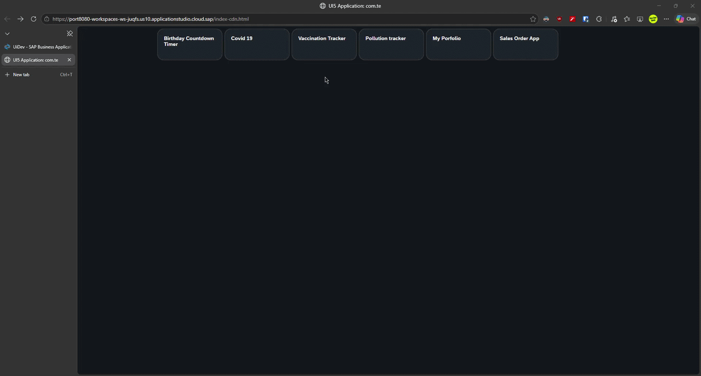
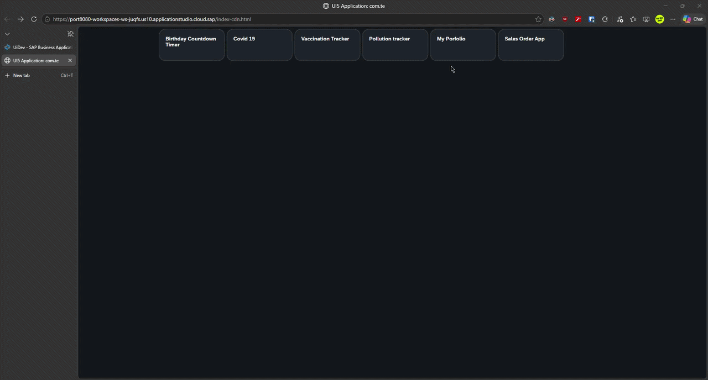
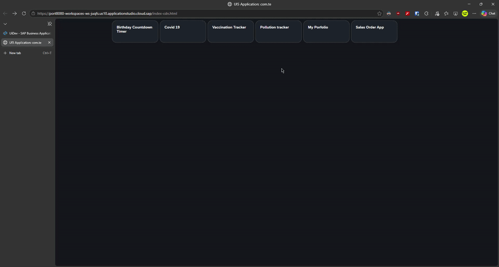
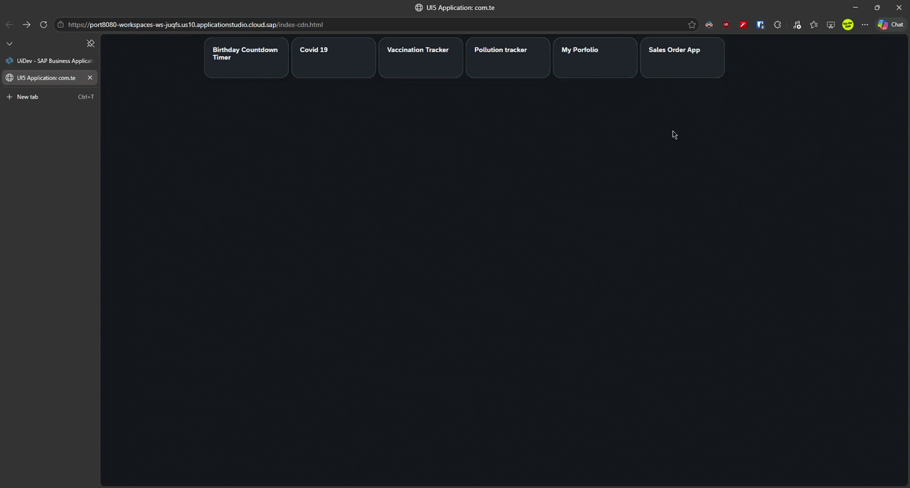

# SAPUI5 Application Suite

A comprehensive workspace containing **six SAPUI5 applications** — a multi-app hub with three integrated sub-applications and three standalone business applications. Built with SAPUI5 following SAP Fiori design guidelines and deployable to SAP BTP Cloud Foundry.

## Table of Contents

- [Applications Overview & Results](#applications-overview--results)
  - [1. com.te — Multi-App Hub](#1-comte--multi-app-hub)
  - [2. com.te.myportfolio — Personal Portfolio](#2-comtemyportfolio--personal-portfolio)
  - [3. com.te.pollutiontracker — Pollution Tracker](#3-comtepoltutiontracker--pollution-tracker)
  - [4. com.te.salesorder — Sales Order Manager](#4-comtesalesorder--sales-order-manager)
- [Technical Stack](#technical-stack)
- [Configuration & Prerequisites](#configuration--prerequisites)
- [Key Features](#key-features)
- [Setup & Installation](#setup--installation)
- [Project Structure](#project-structure)
- [Credits & Learning Resources](#credits--learning-resources)

---

## Applications Overview & Results

### 1. `com.te` — Multi-App Hub

A tile-based navigation hub that hosts **three sub-applications** and provides external links to the other workspace apps deployed on SAP BTP.

| Sub-App | Feature | Data Source |
|---|---|---|
| **Birthday Countdown Timer** | Real-time countdown with days/hours/minutes/seconds using `GenericTile` + `NumericContent` | Client-side `JSONModel` with `setInterval` |
| **Covid-19 Tracker** | Line chart (history), pie chart (regional distribution), and regional list view | `api.rootnet.in/covid19-in/stats` (REST API) + `sap.viz.ui5` |
| **Vaccination Tracker** | Table + `SinglePlanningCalendar` with Day/WorkWeek/Week/Month views, toggle via `RadioButton` | Local `vacc.json` |

#### Result

| Birthday Countdown Timer | Covid-19 Tracker | Vaccination Tracker |
|---|---|---|
|  |  |  |

### 2. `com.te.myportfolio` — Personal Portfolio

A personal profile application using `sap.uxap.ObjectPageLayout` with dynamic header, education/certification/employment sections, and a `TreeTable` for hierarchical employment data.

- **Data Source:** Local `data.json`
- **UI5 Pattern:** `ObjectPageLayout` + `ObjectPageDynamicHeaderTitle`
- **Actions:** "Hire Me", "Refer Me", "Contact Me" buttons

#### Result



### 3. `com.te.pollutiontracker` — Pollution Tracker

A three-column Fiori **Flexible Column Layout** master-detail-drilldown application for tracking air quality by country, state, and city.

- **Router:** `sap.f.routing.Router`
- **Layout:** `sap.f.FlexibleColumnLayout` with `DynamicPage` containers
- **Data Source:** Postman mock REST APIs (countries → states → districts)
- **Layout States:** `OneColumn` → `TwoColumnsMidExpanded` → `ThreeColumnsMidExpanded`

#### Result



### 4. `com.te.salesorder` — Sales Order Manager

An OData v2-driven sales order browser with advanced filtering, value help dialogs, and proxy-based connectivity to the SAP S/4HANA Cloud API Sandbox.

- **Protocol:** OData v2 (`sap.ui.model.odata.v2.ODataModel`)
- **Fragments:** `FilterBar`, `Items` (Table), `ValueHelpDialog`
- **Features:** Multi-input token filters, range operators (EQ/BT/GE/GT/LE/LT/NE/Contains/StartsWith/EndsWith), suggest-as-you-type
- **Proxy:** `ui5-middleware-simpleproxy` → `API_SALES_ORDER_SRV`

#### Result



---

## Technical Stack

### Architecture Overview

The applications follow the standard SAPUI5 **Model-View-Controller (MVC)** pattern and are designed for deployment on **SAP BTP Cloud Foundry**:

| Component | Role |
|---|---|
| **UI Deployer** | (Not explicitly present in this workspace) In a full MTA deployment, the `com.te` app would typically use an `appHost` or `ui-deployer` module to push static resources to SAP BTP's HTML5 Application Repository. |
| **AppRouter** | The SAP BTP Cloud Foundry environment provides a managed `AppRouter` for authentication (XSUAA) and reverse-proxying requests to backend services. The external URLs in `tiles.json` target BTP-deployed instances. |
| **SimpleProxy (Dev)** | `ui5-middleware-simpleproxy` is used at development time to forward `/odata/` requests to the S/4HANA Cloud API Sandbox, eliminating CORS issues. |

### Framework & Libraries

| Attribute | Value |
|---|---|
| **Framework** | SAPUI5 (OpenUI5-compatible) |
| **Minimum UI5 Version** | 1.60.0 (Pollution Tracker) / 1.147.x (All others) |
| **Runtime Versions** | 1.147.1 (`com.te`), 1.147.2 (`myportfolio`, `salesorder`), 1.60.0 (`pollutiontracker`) |
| **Theme** | `sap_horizon` (SAP Horizon) via `themelib_sap_horizon` |
| **Spec Version** | `ui5.yaml` specVersion `"4.0"` |

#### SAPUI5 Libraries in Use

| Library | Used By |
|---|---|
| `sap.ui.core` | All apps |
| `sap.m` | All apps |
| `sap.ui.unified` | `com.te` (CalendarAppointment) |
| `sap.viz` | `com.te` (VizFrame line/pie charts) |
| `sap.uxap` | `com.te.myportfolio` (ObjectPageLayout) |
| `sap.f` | `com.te.pollutiontracker` (FlexibleColumnLayout, DynamicPage) |
| `sap.ui.comp` | `com.te.salesorder` (FilterBar, ValueHelpDialog) |
| `sap.ui.layout` | `com.te.pollutiontracker` |

---

## Configuration & Prerequisites

### Environment Requirements

| Tool / Runtime | Version / Purpose |
|---|---|
| **Node.js** | ≥ 18.x (for UI5 Tooling) |
| **npm** | ≥ 9.x |
| **SAPUI5 CLI** | `@ui5/cli ^4.0.26` |
| **Cloud MTA Build Tool (MBT)** | For production builds targeting SAP BTP |
| **Cloud Foundry CLI (cf)** | For deployment to SAP BTP |
| **SAP BTP Account** | With `Authorization & Trust Management` (XSUAA) and `Destination` service entitlements |

### MTA Configuration (Conceptual)

While this workspace does not include a top-level `mta.yaml`, the architectural pattern for a full BTP deployment would define:

```yaml
# Conceptual mta.yaml structure
_schema-version: "3.2"
ID: sap.ui5.projects
version: 1.0.0

modules:
  - name: com.te-apphost
    type: apphost.nodejs  # Hosts the HTML5 apps
    requires:
      - name: sapui5-projects-uaa

  - name: com.te-db
    type: hdb            # Optional HDI container (not used in these apps)

resources:
  - name: sapui5-projects-uaa
    type: org.cloudfoundry.managed-service
    parameters:
      service: xsuaa
      service-plan: application
```

### Service Bindings (manifest.json)

| App | Data Source | Type | URI / Endpoint |
|---|---|---|---|
| `com.te.salesorder` | `SalesOrder` | OData v2 | `/odata/` (proxied → `API_SALES_ORDER_SRV`) |
| `com.te.pollutiontracker` | Countries, States, Districts | REST (Mock) | `mock.pstmn.io` (Postman) |
| `com.te` (Covid) | Covid History, Latest Stats | REST | `api.rootnet.in/covid19-in/stats` |

#### Destination Service (for BTP Deployment)

When deployed to Cloud Foundry, the SalesOrder app would require a **Destination** pointing to the S/4HANA Cloud API Sandbox:

```json
{
  "Name": "SalesOrderAPI",
  "Type": "HTTP",
  "URL": "https://sandbox.api.sap.com/s4hanacloud/sap/opu/odata/sap/API_SALES_ORDER_SRV",
  "Authentication": "NoAuthentication",
  "ProxyType": "Internet",
  "Headers": [
    { "Key": "APIKey", "Value": "<your-api-key>" }
  ]
}
```

---

## Key Features

### Feature Matrix

| Feature | `com.te` (Hub) | `com.te.myportfolio` | `com.te.pollutiontracker` | `com.te.salesorder` |
|---|---|---|---|---|
| **UI5 Patterns** | | | | |
| Fragments | — | — | — | FilterBar, Items, ValueHelpDialog |
| Custom Formatters | `formatValue` (uppercase) | `formatValue` (uppercase) | `formatValue` (uppercase) | `formatValue` (uppercase) |
| i18n (en/de) | ✅ | ✅ | ✅ | ✅ |
| Device Model | ✅ | ✅ | — | ✅ |
| `core:require` | ✅ | ✅ | — | ✅ |
| **Model Types** | | | | |
| OData v2 | — | — | — | ✅ (`sap.ui.model.odata.v2.ODataModel`) |
| JSON Model | ✅ (local + REST) | ✅ (local `data.json`) | ✅ (REST APIs) | ✅ (cols config) |
| Resource Model | ✅ (i18n) | ✅ (i18n) | ✅ (i18n) | ✅ (i18n) |
| **Functional Logic** | | | | |
| CRUD (Read) | — | — | — | ✅ (OData read via `/A_SalesOrder`) |
| Routing / Navigation | ✅ (6 routes, `sap.m.routing.Router`) | ✅ (single route) | ✅ (4 routes, `sap.f.routing.Router` + FCL) | ✅ (single route) |
| Filtering | — | — | — | ✅ (FilterBar + MultiInput + ValueHelp range filters) |
| Charts / Viz | ✅ (line + pie via `sap.viz.ui5`) | — | — | — |
| Calendar | ✅ (`SinglePlanningCalendar`) | — | — | — |
| Real-time Timer | ✅ (1s `setInterval` countdown) | — | — | — |
| Master-Detail-Drilldown | — | — | ✅ (3-column FCL) | — |
| Object Page | — | ✅ (`ObjectPageLayout`) | — | — |
| Tree Table | — | ✅ (`TreeTable`, employment hierarchy) | — | — |
| Sorting | — | — | — | ✅ (by SalesOrder) |

### Fragments Breakdown (`com.te.salesorder`)

| Fragment | Type | Key Details |
|---|---|---|
| `Filter.fragment.xml` | `sap.ui.comp.filterbar.FilterBar` | 3 filter items: SalesOrder (MultiInput + suggestion), SalesOrderType (Input), SalesOrganization (Input) |
| `Items.fragment.xml` | `sap.m.Table` | Bound to `/A_SalesOrder`, 5 columns, sorted by SalesOrder |
| `SOHelp.fragment.xml` | `sap.ui.comp.valuehelpdialog.ValueHelpDialog` | Range-supported (EQ, BT, Contains, StartsWith, EndsWith, GE, GT, LE, LT, NE), key/description value help |

---

## Setup & Installation

### Prerequisites

```bash
# Install UI5 CLI globally (if not already installed)
npm install --global @ui5/cli
```

### Dependencies

Install dependencies for each application (or all in parallel):

```bash
# For each app, run:
npm install

# Or install all at once:
for app in com.te com.te.myportfolio com.te.pollutiontracker com.te.salesorder; do
  (cd "$app" && npm install)
done
```

### Local Development

Each application runs on a dedicated port to allow simultaneous development:

| App | Port | Command |
|---|---|---|
| `com.te` | `8080` | `npm start` |
| `com.te.pollutiontracker` | `8081` | `npm start` |
| `com.te.myportfolio` | `8082` | `npm start` |
| `com.te.salesorder` | `8083` | `npm start` |

```bash
# Standard UI5 serve with live-reload
cd com.te && ui5 serve --port 8080 -o index.html

# Or using npx Fiori run (if SAP Fiori tools are installed)
npx fiori run --port 8080

# CDN variant (loads UI5 from SAP CDN instead of local)
npm run start-cdn
```

### Production Build

```bash
# Standard build (outputs to dist/)
npm run build

# Self-contained optimized build (includes all UI5 resources)
npm run build:opt
```

### Deployment (SAP BTP Cloud Foundry)

Using the **Cloud MTA Build Tool (MBT)** and **Cloud Foundry CLI**:

```bash
# 1. Build the MTA archive
mbt build -t ./archive

# 2. Deploy to Cloud Foundry
cf deploy ./archive/*.mtar
```

### Testing

Each application includes QUnit (unit), OPA (integration), and WDIO (e2e) tests:

```bash
# Run lint + unit + integration tests with coverage
npm test

# Run e2e tests only
npm run wdi5
```

---

## Project Structure

```
SAP_UI5_Projects/
│
├── com.te/                          # Multi-App Hub (3 sub-apps)
│   ├── package.json                 # Dependencies & scripts (port 8080)
│   ├── ui5.yaml                     # UI5 config (1.147.1, sap.viz, sap.ui.unified)
│   ├── ui5-dist.yaml                # Distribution build config
│   ├── webapp/
│   │   ├── manifest.json            # App descriptor (6 routes)
│   │   ├── Component.js             # Root component
│   │   ├── index.html / index-cdn.html
│   │   ├── controller/
│   │   │   ├── App.controller.js
│   │   │   ├── BaseController.js
│   │   │   ├── Main.controller.js
│   │   │   ├── Tiles.controller.js   # Tile navigation hub
│   │   │   ├── countdown/
│   │   │   │   └── Countdown.controller.js  # Birthday timer logic
│   │   │   ├── covid/
│   │   │   │   ├── Covid.controller.js     # Line chart (VizFrame)
│   │   │   │   ├── List.controller.js      # Regional list
│   │   │   │   └── Pie.controller.js       # Pie chart
│   │   │   └── vacc/
│   │   │       └── Vacc.controller.js      # Table/Calendar toggle
│   │   ├── view/
│   │   │   ├── App.view.xml
│   │   │   ├── Main.view.xml
│   │   │   ├── Tiles.view.xml             # GenericTile launcher grid
│   │   │   ├── countdown/
│   │   │   │   └── Countdown.view.xml     # NumericContent tiles
│   │   │   ├── covid/
│   │   │   │   ├── Covid.view.xml         # VizFrame line chart
│   │   │   │   ├── List.view.xml          # StandardListItem list
│   │   │   │   └── Pie.view.xml           # VizFrame pie chart
│   │   │   └── vacc/
│   │   │       └── Vacc.view.xml          # Table + SinglePlanningCalendar
│   │   ├── model/
│   │   │   ├── data.json                  # Fallback COVID data
│   │   │   ├── tiles.json                 # Tile definitions (6 tiles)
│   │   │   ├── vacc.json                  # Vaccination schedule
│   │   │   ├── formatter.js               # formatValue (uppercase)
│   │   │   └── models.js
│   │   └── i18n/
│   │       ├── i18n.properties
│   │       ├── i18n_en.properties
│   │       └── i18n_de.properties
│   │
│   ├── com.te.myportfolio/           # Personal Portfolio App
│   │   ├── package.json              # Dependencies & scripts (port 8082)
│   │   ├── ui5.yaml                  # UI5 config (1.147.2, sap.uxap)
│   │   ├── webapp/
│   │   │   ├── manifest.json         # Single route
│   │   │   ├── Component.js
│   │   │   ├── controller/
│   │   │   │   ├── App.controller.js
│   │   │   │   ├── BaseController.js
│   │   │   │   └── Main.controller.js
│   │   │   ├── view/
│   │   │   │   ├── App.view.xml
│   │   │   │   └── Main.view.xml     # ObjectPageLayout + TreeTable
│   │   │   ├── model/
│   │   │   │   ├── data.json         # Profile data (education, certs, employment)
│   │   │   │   ├── formatter.js
│   │   │   │   └── models.js
│   │   │   └── i18n/
│   │   │       ├── i18n.properties
│   │   │       ├── i18n_en.properties
│   │   │       └── i18n_de.properties
│   │   │
│   │   ├── com.te.pollutiontracker/  # Pollution Tracker (Fiori 3-column)
│   │   │   ├── package.json          # Dependencies & scripts (port 8081)
│   │   │   ├── ui5.yaml              # UI5 config (1.60.0, sap.f)
│   │   │   ├── webapp/
│   │   │   │   ├── manifest.json     # 4 routes with sap.f.routing.Router
│   │   │   │   ├── Component.js
│   │   │   │   ├── index.js          # Standalone bootstrap
│   │   │   │   ├── controller/
│   │   │   │   │   ├── BaseController.js
│   │   │   │   │   ├── Main.controller.js
│   │   │   │   │   ├── Master.controller.js   # Countries list
│   │   │   │   │   ├── Detail.controller.js   # States list
│   │   │   │   │   └── City.controller.js     # Districts list
│   │   │   │   ├── view/
│   │   │   │   │   ├── Main.view.xml
│   │   │   │   │   ├── Master.view.xml        # DynamicPage + Table (Countries)
│   │   │   │   │   ├── Detail.view.xml        # DynamicPage + Table (States)
│   │   │   │   │   └── City.view.xml          # DynamicPage + Table (Cities)
│   │   │   │   ├── model/
│   │   │   │   │   ├── formatter.js
│   │   │   │   │   └── models.js
│   │   │   │   ├── css/style.css
│   │   │   │   └── i18n/
│   │   │   │       ├── i18n.properties
│   │   │   │       ├── i18n_en.properties
│   │   │   │       ├── i18n_en_US.properties
│   │   │   │       └── i18n_de.properties
│   │   │   │
│   │   │   └── com.te.salesorder/    # Sales Order App (OData v2)
│   │   │       ├── package.json      # Dependencies & scripts (port 8083)
│   │   │       ├── ui5.yaml          # UI5 config (1.147.2, simpleproxy)
│   │   │       ├── webapp/
│   │   │       │   ├── manifest.json # OData v2 data source (/odata/)
│   │   │       │   ├── Component.js
│   │   │       │   ├── controller/
│   │   │       │   │   ├── App.controller.js
│   │   │       │   │   ├── BaseController.js
│   │   │       │   │   └── Main.controller.js  # Filter + ValueHelp + Search
│   │   │       │   ├── view/
│   │   │       │   │   ├── App.view.xml
│   │   │       │   │   ├── Main.view.xml
│   │   │       │   │   ├── Filter.fragment.xml      # FilterBar (3 fields)
│   │   │       │   │   ├── Items.fragment.xml        # SalesOrder table
│   │   │       │   │   └── SOHelp.fragment.xml       # ValueHelpDialog
│   │   │       │   ├── model/
│   │   │       │   │   ├── formatter.js
│   │   │       │   │   └── models.js
│   │   │       │   └── i18n/
│   │   │       │       ├── i18n.properties
│   │   │       │       ├── i18n_en.properties
│   │   │       │       └── i18n_de.properties
│   │   │       │
│   │   │       └── com.te.Assets/    # Shared Assets
│   │   │           ├── BirthDayCounterApp.gif
│   │   │           ├── CovidTrackerApp.gif
│   │   │           ├── VaccinationTrackerApp.gif
│   │   │           ├── MyPortfolioApp.gif
│   │   │           ├── PollutionTrackerApp.gif
│   │   │           └── SalesOrderApp.gif
```

> **Note on nesting:** The diagram above shows the logical grouping. In the actual filesystem, `com.te.myportfolio`, `com.te.pollutiontracker`, `com.te.salesorder`, and `com.te.Assets` are siblings of `com.te`, not nested within it.

---

## Credits & Learning Resources

This project was developed as a learning and portfolio showcase by **Vasu Sena Gunda**.

### Architectural Guidance

Special thanks to the **Nabheet Madan YouTube Playlist** for providing architectural guidance on SAPUI5 application patterns, SAP BTP deployment strategies, and Fiori design principles:

[](https://www.youtube.com/watch?v=rqWzbEJ7ROE&list=PLFPD0TdUpypntI0C5wbZgCW3wadC4ZSJq)

### Tools & Frameworks

| Technology | Purpose |
|---|---|
| [SAPUI5](https://ui5.sap.com/) | UI framework |
| [UI5 Tooling](https://sap.github.io/ui5-tooling/) | Build & development server |
| [SAP BTP](https://www.sap.com/products/business-technology-platform.html) | Deployment target |
| [S/4HANA Cloud API Sandbox](https://api.sap.com/) | OData backend for SalesOrder |
| [WebdriverIO](https://webdriver.io/) | E2E testing with `wdio-ui5-service` |
| [ESLint](https://eslint.org/) | Code quality |
| [Postman Mock Servers](https://www.postman.com/) | API simulation for Pollution Tracker |

---

<p align="center">
  Built with ❤️ using SAPUI5</a>
</p>
